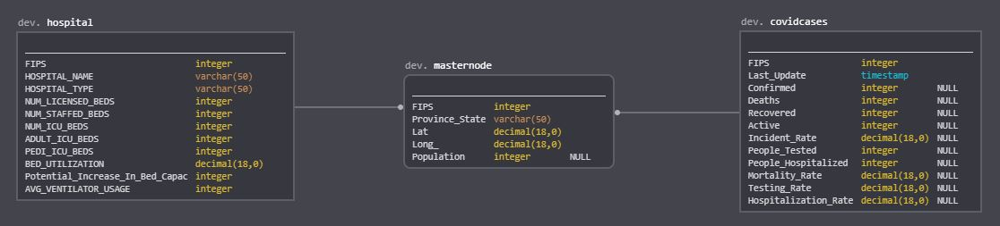

# Data Engineering Nanodegree
## Capstone Project
Ashraf Hussain 
August 3, 2020

Data Engineer Nanodegree: 

## I. Definition

### Project Overview
On 31 December, 2019, the World Health Organization (WHO) was informed of an outbreak of “pneumonia of unknown cause” detected in Wuhan City, Hubei Province, China. Initially identified as coronavirus disease 2019, it quickly came to be known widely as COVID-19 and has resulted in an ongoing global pandemic. As of 5 Augest, 2020, more than 18.95 million cases have been reported across 188 countries and territories, resulting in more than 0.7 million deaths. More than 12.14 million people have recovered.[^1]

In response to this ongoing public health emergency, Johns Hopkins University (JHU), a private research university in Maryland, USA, developed an interactive web-based dashboard hosted by their Center for Systems Science and Engineering (CSSE). The dashboard visualizes and tracks reported cases in real-time, illustrating the location and number of confirmed COVID-19 cases, deaths and recoveries for all affected countries. It is used by researchers, public health authorities, news agencies and the general public.

In that project we will desgine a ETL procress to import csv files form [csse_covid_19_daily_reports_us](https://github.com/CSSEGISandData/COVID-19/tree/master/csse_covid_19_data/csse_covid_19_daily_reports_us) by JHU which enriched by mapping USA Hospital Beds data from [USA Hospital Beds - COVID-19 | Definitive Healthcare](https://console.aws.amazon.com/dataexchange/home?region=us-east-1#/subscriptions/prod-ydzs6f2cju6qc). The fact table we will use [UID_ISO_FIPS_LookUp_Table.csv](https://github.com/CSSEGISandData/COVID-19/blob/master/csse_covid_19_data/UID_ISO_FIPS_LookUp_Table.csv "UID_ISO_FIPS_LookUp_Table.csv")

This project will tackel the ETL procress using the following tools:
 - [AWS CloudFormation](https://aws.amazon.com/cloudformation/): allows you to use programming languages or a simple text file to model and provision, in an automated and secure manner, all the resources needed for your applications across all regions and accounts. This gives you a single source of truth for your AWS and third party resources.
 - [Apache Airflow](https://airflow.apache.org/): Platform created by the community to programmatically author, schedule and monitor workflows.
 - [Amazon Redshift](https://aws.amazon.com/redshift/): The most popular and fastest cloud data warehouse
 - [AWS Data Exchange](https://aws.amazon.com/data-exchange/): makes it easy to find, subscribe to, and use third-party data in the cloud. Qualified data providers include category-leading brands such as Reuters, who curate data from over 2.2 million unique news stories per year in multiple languages; Change Healthcare, who process and anonymize more than 14 billion healthcare transactions and $1 trillion in claims annually; Dun & Bradstreet, who maintain a database of more than 330 million global business records; and Foursquare, whose location data is derived from 220 million unique consumers and includes more than 60 million global commercial venues

### Prerequisites
***IMPORTANT:*** 
1. Don't forget to delete the Stacks, Pipelines and ensure that all resources are deleted this includes CloudFormation Stacks, S3 Buckets, EC2, and Redshift
2. Make sure that region is set to US East (N. Virginia) [us-east-1] else things will not work.
#### IAM user:
 1. Create a new IAM user in your AWS account
 2. Give it `AdministratorAccess`, From `Attach existing policies directly` Tab
 3. Take note of the access key and secret 

#### Install AWS CLI and Configure
 1. Follow the instructions on 
	 - [Installing the AWS CLI version 2 on Windows](https://docs.aws.amazon.com/cli/latest/userguide/install-cliv2-windows.html)
	 - [Configure the AWS CLI on a Raspberry Pi](https://ownthe.cloud/posts/configure-aws-cli-on-raspberry-pi/)
3. Run `aws configure`
4. Past access key and secret 

#### Generate An AWS Key Pair for Airflow
 1. create an Amazon EC2 key pair:
 2. Go to the Amazon EC2 console
 3. In the Navigation pane, click Key Pairs
 4. On the Key Pairs page, click Create Key Pair
 5. In the Create Key Pair dialog box, enter a name for your key pair, such as, mykeypair
 6. Make sure that you select ppk under File format
 7. Click Create
 8. Save the resulting PEM file in a safe location

#### Set up the infrastructure
```
The stack resources take around 15 minutes to create, while the airflow installation and bootstrap 
another 3 to 5 minutes. After that you can already access the Airflow UI and deploy your own Airflow DAGs.
Total time could take up 30 Minutes and could the cost could Skyrocket if left running for a long duration of time. 
```


##### Setup Redshift
1. Download [Data-Engineering-Capstone-Project-Redshift.yaml](https://github.com/sahussain/Data-Engineering-Capstone-Project/blob/master/Infrastructure/Data-Engineering-Capstone-Project-Redshift.yaml "Data-Engineering-Capstone-Project-Redshift.yaml")
2. Go to AWS Cloud Formation page
3. Click Create stack
4. Click upload file and choose [Data-Engineering-Capstone-Project-Redshift.yaml](https://github.com/sahussain/Data-Engineering-Capstone-Project/blob/master/Infrastructure/Data-Engineering-Capstone-Project-Redshift.yaml "Data-Engineering-Capstone-Project-Redshift.yaml")
5. Fill in the stack name as `redshift`
6. Fill in the `Parameters` and click `Next`
8. Don't fill any thing on `Configure stack options` and Click `Next`
9. On Review page click `Create stack`

##### Setup Airflow

1. Go to [Turbine git repo](https://github.com/villasv/aws-airflow-stack)
2. Scroll down until you see 'Deploy the stack` and click Launch stack
3. On the Create stack page click `Next`
4. Name your stack airflow and click `Next`. You don't need to change anything on this page
5. Don't fill any thing on `Configure stack options` and Click `Next`
6. On Review page Scroll down to `Capabilities` and check both 
	- I acknowledge that AWS CloudFormation might create IAM resources with custom names.
	- I acknowledge that AWS CloudFormation might require the following capability: CAPABILITY_AUTO_EXPAND
7. Click `Create stack`

#### Update Airflow security group to accept HTTP:
 1. Go to EC2 Dashboard
 2. Click Running instances
 3. Find 
 4. Select it the Instance with the name `turbine-webserver`
 5. Under Security Group select the group which contains the name `webserver`
 6. Click on Security group ID for the `webserver`
 7. Under inbound rules
 8. Click edit Edit inbound rules
 9. Click Add rule
 10. From the first(Type) Drop-down select Custom TCP
 11. In the port Range type 8080
 12. From the next drop-down(source) select my IP
 13. Click Save rules

#### Accessing Airflow:
1. Go to EC2 Dashboard
2.  Click Running instances
3. Find 
4. Select it the Instance with the name `turbine-webserver`
5. copy the `Public DNS (IPv4)`
6. open a browser window
7. past the link and add `:8080`

#### Subscribe to [USA Hospital Beds - COVID-19 | Definitive Healthcare](https://aws.amazon.com/marketplace/pp/USA-Hospital-Beds-COVID-19-Definitive-Healthcare/prodview-yivxd2owkloha)
1. Go to AWS Data Exchange
2. Search for [USA Hospital Beds - COVID-19 | Definitive Healthcare](https://console.aws.amazon.com/dataexchange/home?region=us-east-1#/subscriptions/prod-ydzs6f2cju6qc)
3. Click `Continue to subscribe`
4. Click `Subscribe`

### IMPORTANT: Don't forget to shutdown everything. 
1. Go to AWS CloudFormation console 
2. Select stacks
3. Select `redshift` click `Delete`
4. Select `airflow` click `Delete`
5. The stack will shutdown everything correctly, do not delete Nested stacks or delete es2, s3 buckets independently. It will take up to 15 to 20 minutes to delete. If you don't have any CloudFormation then everything deleted correctly. 
6. Sometimes you will get an error `DELETE_FAILED` in this case you will have to go into `Events` and check why it failed to delete. There is a known error where the current Airflow is not emptying the S3 buckets if they are not empty. The workaround is to run the delete stack once then you get an error then go to S3 and empty the buckets and rerun delete stack. 


## II Database

### Step 1: Scope the Project and Gather Data
The following datasets will be used:
#### [JHU CSSE COVID-19 Dataset](https://github.com/CSSEGISandData/COVID-19/tree/master/csse_covid_19_data/csse_covid_19_daily_reports_us) 
Provided By: Johns Hopkins University (JHU) via GitRepo

**Data Description**
This table contains an aggregation of each USA State level data.

**File naming convention**
MM-DD-YYYY.csv in UTC.

**Field description**
- **Province_State**  - The name of the State within the USA.
- **Country_Region**  - The name of the Country (US).
- **Last_Update**  - The most recent date the file was pushed.
- **Lat**  - Latitude.
- **Long_**  - Longitude.
- **Confirmed**  - Aggregated case count for the state.
- **Deaths**  - Aggregated death toll for the state.
- **Recovered**  - Aggregated Recovered case count for the state.
- **Active**  - Aggregated confirmed cases that have not been resolved (Active cases = total cases - total recovered - total deaths).
- **FIPS**  - Federal Information Processing Standards code that uniquely identifies counties within the USA.
- **Incident_Rate**  - cases per 100,000 persons.
- **People_Tested**  - Total number of people who have been tested.
- **People_Hospitalized**  - Total number of people hospitalized.
- **Mortality_Rate**  - Number recorded deaths * 100/ Number confirmed cases.
- **UID**  - Unique Identifier for each row entry.
- **ISO3**  - Officialy assigned country code identifiers.
- **Testing_Rate**  - Total test results per 100,000 persons. The "total test results" are equal to "Total test results (Positive + Negative)" from  [COVID Tracking Project](https://covidtracking.com/).
- **Hospitalization_Rate**  - US Hospitalization Rate (%): = Total number hospitalized / Number cases. The "Total number hospitalized" is the "Hospitalized – Cumulative" count from  [COVID Tracking Project](https://covidtracking.com/). The "hospitalization rate" and "Total number hospitalized" is only presented for those states which provide cumulative hospital data.

**Update frequency**
-   Once per day between 04:45 and 05:15 UTC.

**Formats**
-   CSV

**Data sources**
Refer to the  [mainpage](https://github.com/CSSEGISandData/COVID-19).

#### [USA Hospital Beds - COVID-19 | Definitive Healthcare](https://aws.amazon.com/marketplace/pp/USA-Hospital-Beds-COVID-19-Definitive-Healthcare/prodview-yivxd2owkloha)

Provided By: [Definitive Healthcare](https://www.definitivehc.com/) via AWS Data Exchange

**Data Description**
This resource includes data on numbers of licensed beds, staffed beds, ICU beds, and the bed utilization rate for the hospitals in the United States.

**Field description**
- **HOSPITAL_NAME** - Name of the hospital
- **HOSPITAL_TYPE** - Type of the hospital (see below for different types)
- **HQ_ADDRESS** - line 1 Civic street address of the hospital
- **HQ_ADDRESS1** - line 2 of Civic street address of the hospital
- **HQ_CITY** - City of the hospital
- **HQ_STATE** - State of the hospital
- **HQ_ZIP_CODE** - Zip Code of the hospital
- **COUNTY_NAME** - County of the hospital
- **STATE_NAME** - State name in which hospital is located
- **STATE_FIPS** - Federal Information Processing Standard State code (FIPS) of the hospital in which it is located
- **CNTY_FIPS** - Full Federal Information Processing Standard County code (FIPS) of the hospital in which it is located
- **FIPS** - Federal Information Processing Standard County code (FIPS) of the hospital in which it is located
- **NUM_LICENSED_BEDS** - is the maximum number of beds for which a hospital holds a license to operate; however, many hospitals do not operate all the beds for which they are licensed. This number is obtained through DHC Primary Research. Licensed beds for Health Systems are equal to the total number of licensed beds of individual Hospitals within a given Health System.
- **NUM_STAFFED_BEDS** - is defined as an "adult bed, pediatric bed, birthing room, or newborn ICU bed (excluding newborn bassinets) maintained in a patient care area for lodging patients in acute, long term, or domiciliary areas of the hospital." Beds in labor room, birthing room, post-anesthesia, postoperative recovery rooms, outpatient areas, emergency rooms, ancillary departments, nurses and other staff residences, and other such areas which are regularly maintained and utilized for only a portion of the stay of patients (primarily for special procedures or not for inpatient lodging) are not termed a bed for these purposes. Definitive Healthcare sources Staffed Bed data from the Medicare Cost Report or Proprietary Research as needed. As with all Medicare Cost Report metrics, this number is self-reported by providers. Staffed beds for Health Systems are equal to the total number of staffed beds of individual Hospitals within a given Health System. Total number of staffed beds in the US should exclude Hospital Systems to avoid double counting. ICU beds are likely to follow the same logic as a subset of Staffed beds.
- **NUM_ICU_BEDS** - are qualified based on definitions by CMS, Section 2202.7, 22-8.2. These beds include ICU beds, burn ICU beds, surgical ICU beds, premature ICU beds, neonatal ICU beds, pediatric ICU beds, psychiatric ICU beds, trauma ICU beds, and Detox ICU beds.
- **ADULT_ICU_BEDS** - are qualified based on definitions by CMS, Section 2202.7, 22-8.2. These beds include ICU beds, burn ICU beds, surgical ICU beds, premature ICU beds, neonatal ICU beds, pediatric ICU beds, psychiatric ICU beds, trauma ICU beds, and Detox ICU beds. (Adult beds)
- **PEDI_ICU_BEDS** - are qualified based on definitions by CMS, Section 2202.7, 22-8.2. These beds include ICU beds, burn ICU beds, surgical ICU beds, premature ICU beds, neonatal ICU beds, pediatric ICU beds, psychiatric ICU beds, trauma ICU beds, and Detox ICU beds. (Pediatric beds)
- **BED_UTILIZATION** - is calculated based on metrics from the Medicare Cost Report: Bed Utilization Rate = Total Patient Days (excluding nursery days)/Bed Days Available
- **Potential_Increase_In_Bed_Capac** - This metric is computed by subtracting “Number of Staffed Beds from Number of Licensed beds” (Licensed Beds – Staffed Beds). This would provide insights into scenario planning for when staff can be shifted around to increase available bed capacity as needed.
- **AVG_VENTILATOR_USAGE** - number of average ventilators are use

**Hospital Definition:**  Definitive Healthcare defines a hospital as a healthcare institution providing inpatient, therapeutic, or rehabilitation services under the supervision of physicians. In order for a facility to be considered a hospital it must provide inpatient care.

_Hospital types are defined by the last four digits of the hospital’s Medicare Provider Number. If the hospital does not have a Medicare Provider Number, Definitive Healthcare determines the Hospital type by proprietary research._

**Hospital Types**

***Short Term Acute Care Hospital (STAC)***
-   Provides inpatient care and other services for surgery, acute medical conditions, or injuries
-   Patients care can be provided overnight, and average length of stay is less than 25 days

***Critical Access Hospital (CAH)***
-   25 or fewer acute care inpatient beds
-   Located more than 35 miles from another hospital
-   Annual average length of stay is 96 hours or less for acute care patients
-   Must provide 24/7 emergency care services
-   Designation by CMS to reduce financial vulnerability of rural hospitals and improve access to healthcare
-   Religious Non-Medical Health Care Institutions
-   Provide nonmedical health care items and services to people who need hospital or skilled nursing facility care, but for whom that care would be inconsistent with their religious beliefs

***Long Term Acute Care Hospitals***
-   Average length of stay is more than 25 days
-   Patients are receiving acute care - services often include respiratory therapy, head trauma treatment, and pain management
-   Rehabilitation Hospitals
-   Specializes in improving or restoring patients' functional abilities through therapies

***Children’s Hospitals***
-   Majority of inpatients under 18 years old

***Psychiatric Hospitals***
-   Provides inpatient services for diagnosis and treatment of mental illness 24/7
-   Under the supervision of a physician

***Veteran's Affairs (VA) Hospital***
-   Responsible for the care of war veterans and other retired military personnel
-   Administered by the U.S. VA, and funded by the federal government

***Department of Defense (DoD) Hospital***
-   Provides care for military service people (Army, Navy, Air Force, Marines, and Coast Guard), their dependents, and retirees (not all military service retirees are eligible for VA services)

**Update frequency**
-   Daily

**Formats**
-   AWS Data Exchange to S3 as CSV

#### [UID Lookup Table Logic](https://github.com/CSSEGISandData/COVID-19/blob/master/csse_covid_19_data/UID_ISO_FIPS_LookUp_Table.csv)

**Data Description**
This table contains the UID Lookup Table Logic for Federal Information Processing Standard County code (FIPS) mapping to State, Lat, Long etc... .

**File naming convention**
UID_ISO_FIPS_LookUp_Table.csv

**Field description**
1.  All countries without dependencies (entries with only Admin0).

-   None cruise ship Admin0: UID = code3. (e.g., Afghanistan, UID = code3 = 4)
-   Cruise ships in Admin0: Diamond Princess UID = 9999, MS Zaandam UID = 8888.

2.  All countries with only state-level dependencies (entries with Admin0 and Admin1).

-   Demark, France, Netherlands: mother countries and their dependencies have different code3, therefore UID = code 3. (e.g., Faroe Islands, Denmark, UID = code3 = 234; Denmark UID = 208)
-   United Kingdom: the mother country and dependencies have different code3s, therefore UID = code 3. One exception: Channel Islands is using the same code3 as the mother country (826), and its artificial UID = 8261.
-   Australia: alphabetically ordered all states, and their UIDs are from 3601 to 3608. Australia itself is 36.
-   Canada: alphabetically ordered all provinces (including cruise ships and recovered entry), and their UIDs are from 12401 to 12415. Canada itself is 124.
-   China: alphabetically ordered all provinces, and their UIDs are from 15601 to 15631. China itself is 156. Hong Kong, Macau and Taiwan have their own code3.
-   Germany: alphabetically ordered all admin1 regions (including Unknown), and their UIDs are from 27601 to 27617. Germany itself is 276.
-   Italy: UIDs are combined country code (380) with  `codice_regione`, which is from  [Dati COVID-19 Italia](https://github.com/pcm-dpc/COVID-19). Exceptions: P.A. Bolzano is 38041 and P.A. Trento is 38042.

3.  The US (most entries with Admin0, Admin1 and Admin2).

-   US by itself is 840 (UID = code3).
-   US dependencies, American Samoa, Guam, Northern Mariana Islands, Virgin Islands and Puerto Rico, UID = code3. Their Admin0 FIPS codes are different from code3.
-   US states: UID = 840 (country code3) + 000XX (state FIPS code). Ranging from 8400001 to 84000056.
-   Out of [State], US: UID = 840 (country code3) + 800XX (state FIPS code). Ranging from 8408001 to 84080056.
-   Unassigned, US: UID = 840 (country code3) + 900XX (state FIPS code). Ranging from 8409001 to 84090056.
-   US counties: UID = 840 (country code3) + XXXXX (5-digit FIPS code).
-   Exception type 1, such as recovered and Kansas City, ranging from 8407001 to 8407999.
-   Exception type 2, only the New York City, which is replacing New York County and its FIPS code.
-   Exception type 3, Diamond Princess, US: 84088888; Grand Princess, US: 84099999.
-   Exception type 4, municipalities in Puerto Rico are regarded as counties with FIPS codes. The FIPS code for the unassigned category is defined as 72999.

4.  Population data sources.

-   United Nations, Department of Economic and Social Affairs, Population Division (2019). World Population Prospects 2019, Online Edition. Rev. 1.  [https://population.un.org/wpp/Download/Standard/Population/](https://population.un.org/wpp/Download/Standard/Population/)
-   eurostat:  [https://ec.europa.eu/eurostat/web/products-datasets/product?code=tgs00096](https://ec.europa.eu/eurostat/web/products-datasets/product?code=tgs00096)
-   The U.S. Census Bureau:  [https://www.census.gov/data/datasets/time-series/demo/popest/2010s-counties-total.html](https://www.census.gov/data/datasets/time-series/demo/popest/2010s-counties-total.html)
-   Mexico population 2020 projection:  [Proyecciones de población](http://sniiv.conavi.gob.mx/(X(1)S(kqitzysod5qf1g00jwueeklj))/demanda/poblacion_proyecciones.aspx?AspxAutoDetectCookieSupport=1)
-   Brazil 2019 projection: ftp://ftp.ibge.gov.br/Estimativas_de_Populacao/Estimativas_2019/
-   Peru 2020 projection:  [https://www.citypopulation.de/en/peru/cities/](https://www.citypopulation.de/en/peru/cities/)
-   India 2019 population:  [http://statisticstimes.com/demographics/population-of-indian-states.php](http://statisticstimes.com/demographics/population-of-indian-states.php)
-   The Admin0 level population could be different from the sum of Admin1 level population since they may be from different sources.

Disclaimer: *The names of locations included on the Website correspond with the official designations used by the U.S. Department of State. The presentation of material therein does not imply the expression of any opinion whatsoever on the part of JHU concerning the legal status of any country, area or territory or of its authorities. The depiction and use of boundaries, geographic names and related data shown on maps and included in lists, tables, documents, and databases on this website are not warranted to be error free nor do they necessarily imply official endorsement or acceptance by JHU.


The end case is to have the data avaliable in Redshift so that we can build on my other project [Udacity-MLEN-CapstoneProject](https://github.com/sahussain/Udacity-MLEN-CapstoneProject) to forecast number of people cases (Confirmed, Deaths, Recovered, Active), Bed Utilization Rate caused by COVID-19 for a time duration of 30-days in United States based on historical data. This will help hospitals to better manage hospital's resource utilization.

**Update frequency**
-   Only when a new FIPS code added by U.S. Department of State.

**Formats**
-   CSV

### Step 2: Explore and Assess the Data
All data set is very clean and null fields are still used a case to filter for example in UID_ISO_FIPS_LookUp_Table a null value in Admin2 field is to donate a state level details. Since we will be only looking at US data the following filters are needed:

**UID_ISO_FIPS_LookUp_Table.csv**: will be used as fact table with the following filters, which will make sure that we only have US States. 


**Redshift Table Name:** MasterNode

**Filters**:
- Country_Region = "US"
- Admin2 = NULL
- Province_State != Null
- FIPS <=100

**Columns that will be imported**: 
- FIPS
- Province_State
- Lat
- Long_
- Population

**Sample**:
| FIPS | Province_State           | Lat     | Long_     | Population |
|------|--------------------------|---------|-----------|------------|
| 60   | American Samoa           | -14.271 | -170.132  | 55641      |
| 66   | Guam                     | 13.4443 | 144.7937  | 164229     |
| 69   | Northern Mariana Islands | 15.0979 | 145.6739  | 55144      |
| 78   | Virgin Islands           | 18.3358 | -64.8963  | 107268     |
| 72   | Puerto Rico              | 18.2208 | -66.5901  | 2933408    |
| 1    | Alabama                  | 32.3182 | -86.9023  | 4903185    |
| 2    | Alaska                   | 61.3707 | -152.4044 | 731545     |
| 4    | Arizona                  | 33.7298 | -111.4312 | 7278717    |
| 5    | Arkansas                 | 34.9697 | -92.3731  | 3017804    |
| 6    | California               | 36.1162 | -119.6816 | 39512223   |
| 8    | Colorado                 | 39.0598 | -105.3111 | 5758736    |
| 9    | Connecticut              | 41.5978 | -72.7554  | 3565287    |
| 10   | Delaware                 | 39.3185 | -75.5071  | 973764     |
| 11   | District of Columbia     | 38.8974 | -77.0268  | 705749     |
| 12   | Florida                  | 27.7663 | -81.6868  | 21477737   |
| 13   | Georgia                  | 33.0406 | -83.6431  | 10617423   |
| 15   | Hawaii                   | 21.0943 | -157.4983 | 1415872    |
| 16   | Idaho                    | 44.2405 | -114.4788 | 1787065    |
| 17   | Illinois                 | 40.3495 | -88.9861  | 12671821   |
| 18   | Indiana                  | 39.8494 | -86.2583  | 6732219    |
| 19   | Iowa                     | 42.0115 | -93.2105  | 3155070    |


**JHU CSSE COVID-19 Dataset**: will be used as a dimension table and the following fields and filters will be imported:


**Redshift Table Name:** covidcases

**Filters**: 
- Last_Update IsNotNULL
- FIPS <100

**Columns that will be imported**: 
- FIPS
- Last_Update
- Confirmed
- Deaths
- Recovered
- Active
- Incident_Rate
- People_Tested
- People_Hospitalized
- Mortality_Rate
- Testing_Rate
- Hospitalization_Rate

**Sample**:
| Last_Update      | Confirmed | Deaths | Recovered | Active | FIPS | Incident_Rate | People_Tested | People_Hospitalized | Mortality_Rate | Testing_Rate | Hospitalization_Rate |
|------------------|-----------|--------|-----------|--------|------|---------------|---------------|---------------------|----------------|--------------|----------------------|
| 2020/04/12 23:18 | 3563      | 93     |           | 3470   | 1    | 75.98802021   | 21583         | 437                 | 2.610159978    | 460.3001516  | 12.26494527          |
| 2020/04/12 23:18 | 272       | 8      | 66        | 264    | 2    | 45.50404936   | 8038          | 31                  | 2.941176471    | 1344.711576  | 11.39705882          |
| 2020/04/12 23:18 | 3542      | 115    |           | 3427   | 4    | 48.66242224   | 42109         |                     | 3.246753247    | 578.5222863  |                      |
| 2020/04/12 23:18 | 1280      | 27     | 367       | 1253   | 5    | 49.43942261   | 19722         | 130                 | 2.109375       | 761.7533537  | 10.15625             |
| 2020/04/12 23:18 | 22795     | 640    |           | 22155  | 6    | 58.13772584   | 190328        | 5234                | 2.81202018     | 485.4238685  | 22.9611757           |
| 2020/04/12 23:18 | 7307      | 289    |           | 7018   | 8    | 128.943729    | 34873         | 1376                | 3.955111537    | 615.3899908  | 18.8312577           |
| 2020/04/12 23:18 | 12035     | 554    |           | 11481  | 9    | 337.5604825   | 41220         | 1654                | 4.603240548    | 1156.148159  | 13.74324886          |
| 2020/04/12 23:18 | 1625      | 35     | 191       | 1590   | 10   | 166.8782169   | 11103         | 190                 | 2.153846154    | 1140.214672  | 11.69230769          |
| 2020/04/12 23:18 | 1875      | 50     | 493       | 1825   | 11   | 265.6751905   | 10640         |                     | 2.666666667    | 1507.618148  |                      |
| 2020/04/12 23:18 | 19895     | 461    |           | 19434  | 12   | 93.70022691   | 182753        | 2772                | 2.317165117    | 860.7186513  | 13.93314903          |
| 2020/04/12 23:18 | 12452     | 433    |           | 12019  | 13   | 122.8081405   | 54453         | 2505                | 3.477353036    | 537.0439828  | 20.11725024          |
| 2020/04/12 23:18 | 133       | 5      | 58        | 128    | 66   | 80.98447899   | 826           | 13                  | 3.759398496    | 502.9562379  | 9.77443609           |
| 2020/04/12 23:18 | 499       | 9      | 300       | 490    | 15   | 35.24543964   | 17968         | 44                  | 1.803607214    | 1269.118355  | 8.817635271          |
| 2020/04/12 23:18 | 1407      | 27     |           | 1380   | 16   | 87.36433536   | 14308         | 131                 | 1.918976546    | 888.4214004  | 9.310589908          |
| 2020/04/12 23:18 | 20852     | 720    |           | 20132  | 17   | 177.6807818   | 100735        | 3680                | 3.452906196    | 858.3672336  | 17.64818722          |
| 2020/04/12 23:18 | 7928      | 343    |           | 7585   | 18   | 121.1492553   | 42489         |                     | 4.326437941    | 649.2823801  |                      |
| 2020/04/12 23:18 | 1587      | 41     | 674       | 1546   | 19   | 60.55603952   | 17592         | 129                 | 2.583490863    | 671.2677046  | 8.128544423          |
| 2020/04/12 23:18 | 1344      | 56     |           | 1288   | 20   | 55.11612114   | 13253         | 298                 | 4.166666667    | 543.4925249  | 22.17261905          |
| 2020/04/12 23:18 | 1963      | 97     | 464       | 1866   | 21   | 57.34228025   | 24567         | 459                 | 4.9414162      | 717.6402439  | 23.38257769          |
| 2020/04/12 23:18 | 20595     | 840    |           | 19755  | 22   | 447.9836494   | 104045        | 2084                | 4.078659869    | 2263.19295   | 10.11896091          |
| 2020/04/12 23:18 | 633       | 19     | 266       | 614    | 23   | 53.91795272   | 6721          | 120                 | 3.001579779    | 572.4842974  | 18.95734597          |
| 2020/04/12 23:18 | 8225      | 236    | 456       | 7989   | 24   | 138.3903145   | 49764         | 1860                | 2.869300912    | 837.3076732  | 22.61398176          |
| 2020/04/12 23:18 | 25475     | 756    |           | 24719  | 25   | 371.1516059   | 116730        | 2235                | 2.967615309    | 1700.668379  | 8.773307164          |
| 2020/04/12 23:18 | 24244     | 1479   | 433       | 22765  | 26   | 304.2953668   | 79437         | 3636                | 6.100478469    | 997.0430232  | 14.99752516          |
| 2020/04/12 23:18 | 1621      | 70     | 842       | 1551   | 27   | 32.77100367   | 37421         | 361                 | 4.318322023    | 756.5229662  | 22.27020358          |
| 2020/04/12 23:18 | 2781      | 96     |           | 2685   | 28   | 96.05534114   | 21413         | 548                 | 3.451995685    | 739.6019489  | 19.70514204          |
| 2020/04/12 23:18 | 4269      | 118    |           | 4151   | 29   | 72.85659283   | 45200         | 988                 | 2.764113375    | 771.4026695  | 23.14359335          |
| 2020/04/12 23:18 | 387       | 6      | 169       | 381    | 30   | 44.68889256   | 8913          | 47                  | 1.550387597    | 1029.230231  | 12.14470284          |
| 2020/04/12 23:18 | 791       | 17     |           | 774    | 31   | 51.85960275   | 10691         |                     | 2.149178255    | 700.924163   |                      |
| 2020/04/12 23:18 | 2836      | 112    |           | 2724   | 32   | 94.01010443   | 24611         | 282                 | 3.94922426     | 815.8260508  | 9.943582511          |

 **USA Hospital Beds - COVID-19 | Definitive Healthcare**: : will be used as a dimension table and the following fields and filters will be imported:
 
**Redshift Table Name:** hospital

**Filters**: 
- Last_Update IsNotNULL
- STATE_FIPS<100

**Columns that will be imported**: 
- STATE_FIPS
- HOSPITAL_TYPE
- NUM_LICENSED_BEDS
- NUM_STAFFED_BEDS
- NUM_ICU_BEDS
- ADULT_ICU_BEDS
- PEDI_ICU_BEDS
- BED_UTILIZATION
- Potential_Increase_In_Bed_Capac
- AVG_VENTILATOR_USAGE

**Sample**:
| Province_State | Country_Region | Last_Update      | Lat     | Long_     | Confirmed | Deaths | Recovered | Active | FIPS | Incident_Rate | People_Tested | People_Hospitalized | Mortality_Rate | UID      | ISO3 | Testing_Rate | Hospitalization_Rate |
|----------------|----------------|------------------|---------|-----------|-----------|--------|-----------|--------|------|---------------|---------------|---------------------|----------------|----------|------|--------------|----------------------|
| Alabama        | US             | 2020/04/12 23:18 | 32.3182 | -86.9023  | 3563      | 93     |           | 3470   | 1    | 75.98802021   | 21583         | 437                 | 2.610159978    | 84000001 | USA  | 460.3001516  | 12.26494527          |
| Alaska         | US             | 2020/04/12 23:18 | 61.3707 | -152.4044 | 272       | 8      | 66        | 264    | 2    | 45.50404936   | 8038          | 31                  | 2.941176471    | 84000002 | USA  | 1344.711576  | 11.39705882          |
| Arizona        | US             | 2020/04/12 23:18 | 33.7298 | -111.4312 | 3542      | 115    |           | 3427   | 4    | 48.66242224   | 42109         |                     | 3.246753247    | 84000004 | USA  | 578.5222863  |                      |
| Arkansas       | US             | 2020/04/12 23:18 | 34.9697 | -92.3731  | 1280      | 27     | 367       | 1253   | 5    | 49.43942261   | 19722         | 130                 | 2.109375       | 84000005 | USA  | 761.7533537  | 10.15625             |
| California     | US             | 2020/04/12 23:18 | 36.1162 | -119.6816 | 22795     | 640    |           | 22155  | 6    | 58.13772584   | 190328        | 5234                | 2.81202018     | 84000006 | USA  | 485.4238685  | 22.9611757           |
| Colorado       | US             | 2020/04/12 23:18 | 39.0598 | -105.3111 | 7307      | 289    |           | 7018   | 8    | 128.943729    | 34873         | 1376                | 3.955111537    | 84000008 | USA  | 615.3899908  | 18.8312577           |
| Connecticut    | US             | 2020/04/12 23:18 | 41.5978 | -72.7554  | 12035     | 554    |           | 11481  | 9    | 337.5604825   | 41220         | 1654                | 4.603240548    | 84000009 | USA  | 1156.148159  | 13.74324886          |
| Delaware       | US             | 2020/04/12 23:18 | 39.3185 | -75.5071  | 1625      | 35     | 191       | 1590   | 10   | 166.8782169   | 11103         | 190                 | 2.153846154    | 84000010 | USA  | 1140.214672  | 11.69230769          |

### Step 3: Define the Data Model
**Database Schema Design**
The project creates a redshift database in a AWS cluster using AWS CloudFormation. Then AWS CodePipeline and  CloudFormation is used to import the raw data into S3 buckets. Apache Airflow DAGs creates pre-defined empty tables in redshift then it opied over to the tables from s3 bucket. Apache Airflow DAGs helps with parallelizing the execution of queries on multiple workers. 

**ELT Pipeline**
The project creates a star schema relational database. star schema is the simplest style of data mart schema and is the approach most widely used to develop data warehouses and dimensional data marts.[1] The star schema consists of one or more fact tables referencing any number of dimension tables. The star schema is an important special case of the snowflake schema, and is more effective for handling simpler queries.[^2]

The star schema was chosen because of the end case scenario because the end the dataset would be utilized in machine learning model.


Hear are the summary of the steps we will take to ETL the data into redshift:
- AWS CloudFormation to setup our infrastructure.  
- AWS CodePipeline to bring in data from [JHU COVID-19 git repo](https://github.com/CSSEGISandData/COVID-19)
- AWS Data Exchange to subcribe to [USA Hospital Beds - COVID-19 | Definitive Healthcare](https://console.aws.amazon.com/dataexchange/home?region=us-east-1#/subscriptions/prod-ydzs6f2cju6qc).
- AWS CloudFormation to get the [USA Hospital Beds - COVID-19 | Definitive Healthcare](https://console.aws.amazon.com/dataexchange/home?region=us-east-1#/subscriptions/prod-ydzs6f2cju6qc) data into an S3 buckit.
- We will use Apache Airflow DAGs to select data for US only, marge the data into one table and move data from S3 to redshift

**Stage Tables**


**Fact & Dimension Table**


### Step 4: Run ETL to Model the Data

Fellow the steps below to Run the ETL

#### Importing data from github to S3: [JHU COVID-19 git repo](https://github.com/CSSEGISandData/COVID-19)
1. Go to [JHU COVID-19 git repo](https://github.com/CSSEGISandData/COVID-19) and fork the Repo
2. Go to your fork go to git actions and create a new action with the following code
```yml
# .github/workflows/main.yml
# This code was updated form orginal https://stackoverflow.com/questions/23793062/can-forks-be-synced-automatically-in-github by user N1ngu
# There was some errord in the orginal code 
# This will update the fork with orginal every 15 min between 4 and 6 UTC

name: Merge upstream branches
on:
  schedule:
     # actually, ~5 minutes is the highest
     # effective frequency you will get
    - cron:  '*/15 4-6 * * *'
jobs:
  merge:
    runs-on: ubuntu-latest
    steps:
      - uses: actions/checkout@v2
      - name: Merge upstream
        run: |
          git config --global user.name 'sahussain'
          git config --global user.email 'sahussain@users.noreply.github.com'

          # "git checkout master" is unnecessary, already here by default
          git pull --unshallow  # this option is very important, you would get
                                # complains about unrelated histories without it.
                                # (but actions/checkout@v2 can also be instructed
                                # to fetch all git depth right from the start)

          git remote add upstream https://github.com/CSSEGISandData/COVID-19.git
          git checkout master
          git fetch --all
          git merge upstream/master
          git push origin master
```
3. Go to AWS **CodePipeline**
4. Click the `Create pipeline` button
5. Name the pipeline Github-to-S3
6. Click `Adcanced settings`
7. Make sure Artifact store and  Encryption key is set to default 
8. Select the Source provider: `Github` if this is the first time click `Connect to Github` button, enter your credentials and click authorize
9. Repository select the fork repo
10. Branch Select master
11. Leave Change detection options to GitHub webhooks
12. Click Next
13. On the Add build stage Click `Skip build stage`
14. Click `Skip`
15. Select the Deploy provider Amazon S3
16. Select the bucket you created when you run redshift CloudFormation
17. Check `Extract file before deploy`
18. Click Create pipeline

#### Importing AWS Data Exchange to S3: [USA Hospital Beds - COVID-19 | Definitive Healthcare](https://aws.amazon.com/marketplace/pp/USA-Hospital-Beds-COVID-19-Definitive-Healthcare/prodview-yivxd2owkloha)
1. Go to your [Subscriptions](https://console.aws.amazon.com/dataexchange/home?region=us-east-1#/subscriptions)
2. Under **Entitled data sets** click [USA Hospital Beds | Definitive Healthcare](https://console.aws.amazon.com/dataexchange/home?region=us-east-1#/entitled-data-sets/298d3e38f0022d96e1e3d9f76f31ba00)
3. click on the most recent **Revision ID**
4. Under **Assets** select the csv file 
5. click on `Export to Amazon S3`
6. Select the bucket you created when you run redshift CloudFormation
7. Click `Export`

#### Uploading Dags
On Raspberry Pi
1. Create a airflow folder in your home directory you can just use 
2. In terminal Clone git repo [turbine](https://github.com/villasv/aws-airflow-stack) by running `git clone https://github.com/villasv/aws-airflow-stack.git`
3. Copy airflow content form git repo to your airflow folder
4. Copy makefile to home folder
5. go to terminal and run the following command from your home dir 'make deploy stack-name=airflow'
6. if you get an error code 255 make sure that your aws config under .aws which is in your home folder only have the following line 
```
	[default]
	region = us-east-1
```
#### Add AWS credentials to Airflow Connections
use Airflow's UI to configure your AWS credentials and connection to Redshift.
1. To go to the Airflow UI
2. Click on the **Admin** tab and select **Connections**.
3. Under **Connections**, select **Create**.
4. On the create connection page, enter the following values:
	-   **Conn Id**: Enter  `aws_credentials`.
	-   **Conn Type**: Enter  `Amazon Web Services`.
	-   **Login**: Enter your  **Access key ID**  from the IAM User credentials you downloaded earlier.
	-   **Password**: Enter your  **Secret access key**  from the IAM User credentials you downloaded earlier.

Once you've entered these values, select  **Save**.

#### Add AWS redshift to Airflow Connections
Getting redshift connection settings:
1. Go to AWS CloudFormation console
2. click on redshift click on outputs
	here you'll find all the settings for redshift
3. To go to the Airflow UI
4. Click on the **Admin** tab and select **Connections**.
5. Under **Connections**, select **Create**.
6. On the create connection page, enter the following values:
	-   **Conn Id**: Enter  `redshift`.
	-   **Conn Type**: Enter  `Postgres`.
	-   **Host**: Enter the endpoint of your Redshift cluster, excluding the port at the end. **IMPORTANT: Make sure to  NOT**  include the port at the end of the Redshift endpoint string.
	-   **Schema**: Enter  `dev`. This is the Redshift database you want to connect to.
	-   **Login**: Enter  `awsuser`.
	-   **Password**: Enter the password you created when launching your Redshift cluster.
	-   **Port**: Enter  `5439`.

Once you've entered these values, select  **Save**.

#### Run the following Dags
open airflow web interface 
1. Initiation only to be run once
2. Data_to_redshift

### Step 5: Complete Project Write Up
The goal of the project was to have the data setup for a ML model. The queries will be decied when desgine the ML model. The reason I chose this model is to demonstrate how we can take COVID-19 data from opensources and map it to redshift. Hopefully when I take [Cloud Dev Ops Engineer](https://www.udacity.com/course/cloud-dev-ops-nanodegree--nd9991) nanodegree I am able to refine the setup procress. The data should be updated daily. 


## Addressing other scenarios

### Data Increased by 100x:
There will be no promble with S3 bucket and Airflow as each is setup to incrise with load dynamically. If the load is too high on the redshift we can delete the old one with shapshort and create a new one with more nodes.

### The pipelines would be run on a daily basis by 7 am every day:
All data expect for AWS Data Exchange is set to run on a daily basis by 7AM UTC

### The database needed to be accessed by 100+ people:
Again there will be no issue we will just have to incrise the redshift nodes and server limits like ra3.16xlarge.

------
# Appendix A
[^1]:[COVID-19 Dashboard](https://systems.jhu.edu/research/public-health/ncov/) by the Center for Systems Science and Engineering (CSSE) at Johns Hopkins University (JHU)". ArcGIS. Johns Hopkins University. Retrieved 20 June 2020.
[^2]:[_DWH Schemas_](https://web.archive.org/web/20100716233800/http://www.dwhworld.com/dwh-schemas/), 2009, archived from [the original](http://www.dwhworld.com/dwh-schemas/) on 16 July 2010
<!--stackedit_data:
eyJoaXN0b3J5IjpbLTk0OTg1MDM1MCw4Mzk5Mzg2ODEsLTE5MD
A0MTc1MTAsMTExMzYxNDAxNiwxODM5NzQxOTIyLC0xNzc4Mjk1
MDY1LDU0NDQxNDQwOSwyMDQ3MDI5MzIxLC0xNDUyOTc2NzU2LD
E1ODE4MTAxOTIsMTMyNTMzOTM1NSwxMzI2Mjg5NzA4LDExNjg0
NDc4NTIsLTE2OTM2NDEyODcsLTE5ODEzMzI5MSwyMDM1NTMyOD
Y5LC0zMDA5NzgzNTcsLTEwMjIyMDY2ODMsLTk2NDY2NzQzNCwx
NTg5MDM2MjEzXX0=
-->